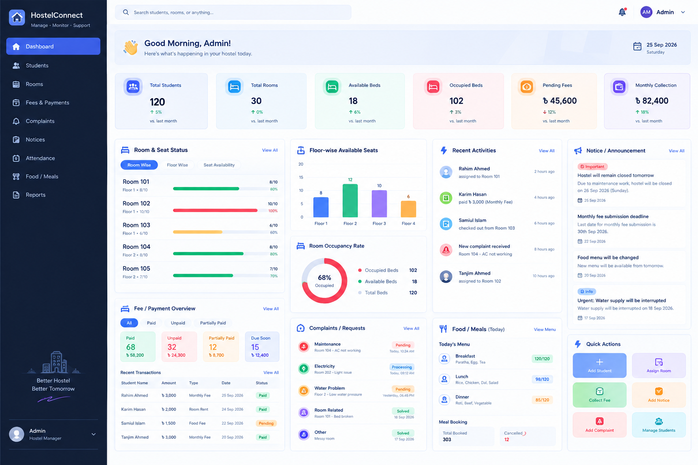
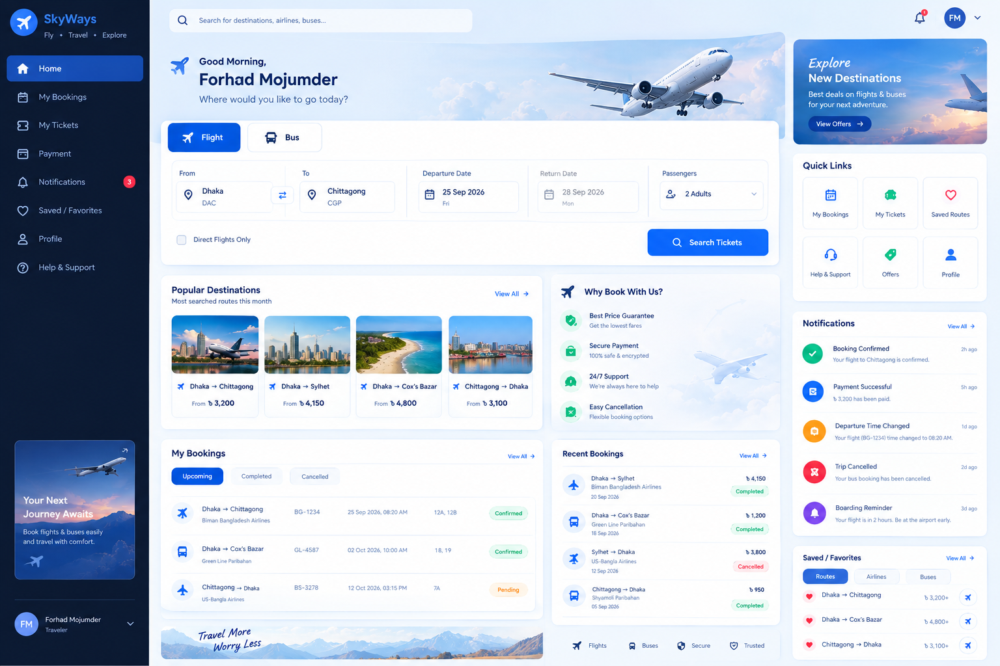

# Figma Design System — UI Practice Projects

<p align="center">
  <strong>Applying Figma Design System concepts to two practical app interfaces</strong>
</p>

<p align="center">
  Hostel Management App &nbsp;•&nbsp; Ticket Booking App
</p>

---

## About 

This documents how I applied the concepts from the **Figma Design System** course to practical UI projects instead of keeping the learning only as theory.

I created two different app concepts:

1. **Hostel Management App** — an admin dashboard for managing students, rooms, fees, complaints, notices and meals.
2. **Flight / Bus Ticket Booking App** — a user dashboard for searching trips, managing bookings, tickets, payments and travel notifications.

The two projects use different visual directions, but both follow the same design-system thinking:

```text
Design Foundations
        ↓
Reusable Components
        ↓
Consistent Layout & Auto Layout
        ↓
UI Screens
        ↓
Prototype / User Flow
        ↓
Developer Handoff
```

> These are personal UI practice projects created to apply course concepts. They are not affiliated with any real hostel, airline, bus company or booking platform.

---

# Project 01 — Hostel Management App

<p align="center">
  
</p>

### Project idea

A practical admin dashboard for a hostel manager. The goal is to bring the most important hostel information into one place so that an administrator can quickly understand occupancy, payments, complaints and daily activities.

### Main functionalities

#### Dashboard Overview

- Total Students
- Total Rooms
- Available Beds
- Occupied Beds
- Pending Fees
- Monthly Collection

#### Room & Seat Management

- Room-wise occupancy
- Available and occupied seats
- Floor-wise seat availability
- Room occupancy progress
- Quick view of room capacity

#### Student Management

- Add Student
- Manage Students
- Assign Room
- Track student assignment activity
- View student-related information

#### Fee & Payment Management

- Paid fees
- Unpaid fees
- Partially paid fees
- Pending amount
- Recent transactions
- Monthly collection overview

#### Complaints / Requests

- Maintenance complaint
- Electricity problem
- Water problem
- Room-related issue
- Other requests
- Status tracking: `Pending / Processing / Solved`

#### Notice & Announcement

- Hostel announcements
- Fee submission reminders
- Maintenance notices
- Food/menu updates
- Important alerts

#### Attendance / Visitor Information

- Attendance overview
- Students outside the hostel
- Visitor count
- Check-in / Check-out information

#### Food / Meal Information

- Today's breakfast
- Today's lunch
- Today's dinner
- Meal booking count
- Cancelled meals
- Daily menu overview

#### Quick Actions

- Add Student
- Assign Room
- Collect Fee
- Add Notice
- Add Complaint
- Manage Students

### Figma Practice

I used this design to practice:

- Creating a dashboard layout with clear visual hierarchy
- Designing summary cards for important information
- Building reusable cards, buttons, badges and status indicators
- Using consistent spacing and alignment across a large interface
- Applying Auto Layout to repeated dashboard sections
- Designing different information states such as `Paid`, `Pending`, `Processing` and `Solved`
- Creating room occupancy and payment information in a visually understandable way
- Organizing a complex dashboard without making every section look disconnected
- Thinking about how a real admin would scan information and take quick actions

### Design learning from this project

The main challenge was **information density**. A hostel management system has many different types of information, so I practiced grouping related information instead of placing everything at the same visual level.

For example:

```text
Summary
   ↓
Room Status + Fees
   ↓
Activities + Complaints + Notices
   ↓
Meals + Quick Actions
```

This helped me practice how a design system can keep a complex dashboard organized.

---

# Project 02 — Flight / Bus Ticket Booking App

<p align="center">
  
</p>

### Project idea

A travel booking interface where users can search for flights or buses, manage upcoming trips, view tickets, track payments and receive travel notifications.

### Main functionalities

#### Search / Book Ticket

- From
- To
- Departure Date
- Return Date
- Passenger count
- Flight / Bus selection
- Direct-trip option
- Search Tickets action

Example flow:

```text
From: Dhaka
To: Chittagong
Date: 25 Sep 2026
Passengers: 2

        ↓

Search Tickets
```

#### My Bookings

- Upcoming Trips
- Completed Trips
- Cancelled Trips
- Booking ID
- Travel date
- Seat number
- Booking status

#### My Tickets

Each ticket can contain:

- Passenger name
- Route
- Date & time
- Seat number
- Ticket / Booking ID
- QR code area
- Download Ticket action

#### Payment

- Recent payments
- Paid amount
- Payment status
- Refund status
- Payment history

#### Notifications

- Booking confirmed
- Payment successful
- Departure time changed
- Trip cancelled
- Boarding reminder

#### Saved / Favorites

- Favorite routes
- Favorite airlines / bus operators
- Saved travel choices

#### Profile

- Name
- Phone
- Email
- Profile picture
- Saved passengers
- Security settings

#### Help & Support

- FAQ
- Contact support
- Booking problem
- Refund request
- Cancellation help

### Figma Practice

I used this design to practice:

- Designing a travel search experience as the main action of a dashboard
- Creating reusable search fields and booking cards
- Designing Flight / Bus as related but selectable options
- Building booking status badges such as `Confirmed`, `Pending`, `Completed` and `Cancelled`
- Creating a consistent card system for destinations and bookings
- Using Auto Layout for search controls and booking rows
- Designing notifications with different priority states
- Creating a clean navigation structure for bookings, tickets, payments and profile
- Practicing visual hierarchy so the booking action remains the main focus
- Thinking about how a real user moves from searching a route to managing a confirmed trip

### User flow practiced

```text
Search Route
     ↓
View Available Trips
     ↓
Select Trip
     ↓
Payment
     ↓
Booking Confirmed
     ↓
My Ticket
```

The dashboard also supports the post-booking experience:

```text
Booking
  ↓
Notification
  ↓
Ticket
  ↓
Travel Reminder
  ↓
Trip Completed
```

---

# Design System Concepts Applied to Both Projects

Although the two applications solve different problems, I used the same core Figma principles.

| Concept | How I applied it |
|---|---|
| Color roles | Primary actions, status, surfaces and supporting information |
| Typography | Clear heading, body and secondary text hierarchy |
| Spacing | Consistent gaps and padding between related elements |
| Components | Reusable buttons, cards, inputs, badges and navigation items |
| Variants | Different component states and types |
| Auto Layout | Structured cards, rows, controls and repeated sections |
| Visual hierarchy | Important actions and information receive stronger emphasis |
| Prototyping | User flows can be connected from one screen to another |
| Handoff | Components, states and layout rules are kept organized |

---

# Why I Made Two Different Projects

The purpose was to test whether the design-system concepts work across different product types.

### Hostel Management

Information-heavy admin interface:

```text
Many data points
      ↓
Grouping
      ↓
Status visualization
      ↓
Quick actions
```

### Ticket Booking

Action-focused consumer interface:

```text
Search
  ↓
Choose
  ↓
Book
  ↓
Manage trip
```

This gave me practice with both **information-dense dashboards** and **task-focused product interfaces**.

---

# My Figma Learning Workflow

```text
1. Understand the product problem
              ↓
2. Identify the important user actions
              ↓
3. Define colors / typography / spacing
              ↓
4. Create reusable components
              ↓
5. Apply Auto Layout
              ↓
6. Build the main screens
              ↓
7. Add states / variants
              ↓
8. Connect the user flow
              ↓
9. Review consistency
              ↓
10. Prepare for handoff
```

---

# Course Certificate

<p align="center">
  <strong>Figma Design System</strong><br>
  Course completion certificate
</p>

[View the certificate](./assets/certificate/Figma-Design-System-Certificate.pdf)

---

# Repository Structure

```text
Figma-Design-System-Project/
│
├── README.md
│
├── assets/
│   ├── apps/
│   │   ├── hostel-management-dashboard.png
│   │   └── ticket-booking-dashboard.png
│   │
│   └── certificate/
│       └── Figma-Design-System-Certificate.pdf
│
└── projects/
    ├── hostel-management/
    └── ticket-booking/
```

---

## Final Takeaway

These projects helped me move from learning individual Figma features to thinking about **how those features work together in a realistic product interface**.

**Foundation → Components → Auto Layout → UI → States → Prototype → Handoff**
