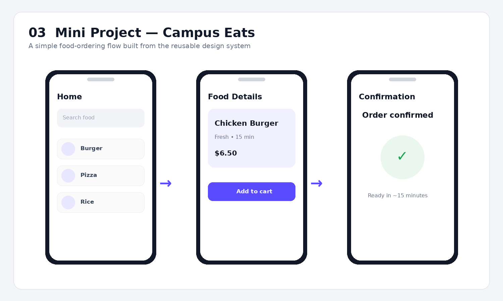
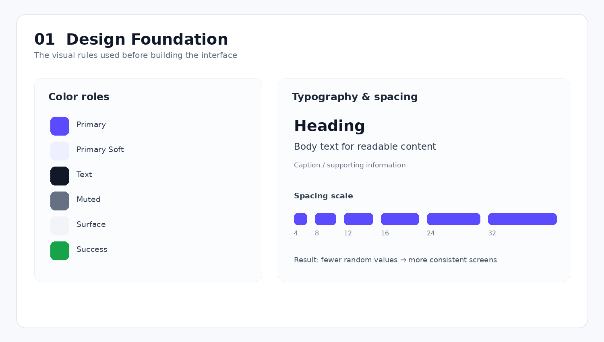
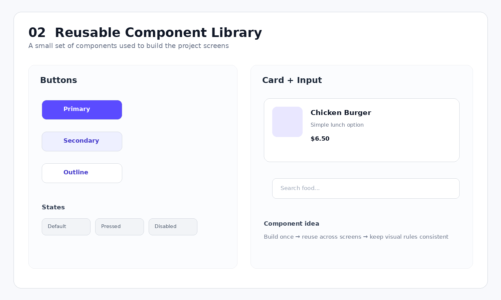
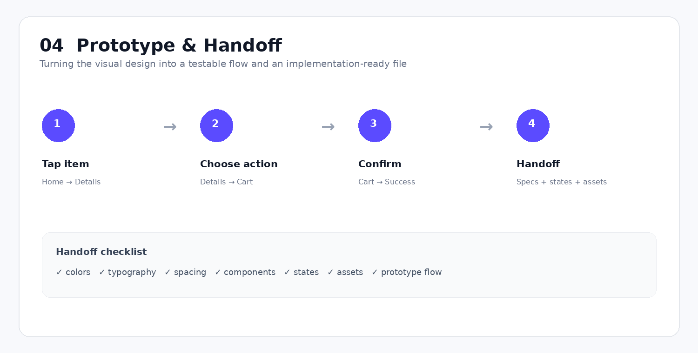

# Figma Design System — Campus Eats UI Project

<p align="center">
  
</p>

<p align="center">
  <strong>A small mobile food-ordering UI project built to apply the concepts learned from the Figma Design System course.</strong>
</p>

---

## Project Overview

Instead of keeping the course as a collection of notes, I applied the main concepts to a small practice project:

**Campus Eats — a simple food-ordering mobile interface.**

The project was used to practice how a design system moves from:

**visual foundations → reusable components → UI screens → prototype flow → developer handoff**

The interface is intentionally small so the design-system decisions stay clear.

> This is a personal learning/practice project and is not affiliated with any external food-delivery company.

---

# What I Built

The project contains three main user screens:

```text
Home
  ↓
Food Details
  ↓
Order Confirmation
```

The same visual rules and reusable components are carried across the screens.

### Main UI elements

- Search field
- Category / food items
- Food card
- Primary button
- Secondary button
- Price information
- Confirmation state
- Consistent typography and spacing

---

# 1. Design Foundation

Before building the screens, I defined a small visual foundation.

<p align="center">
  
</p>

### Color

I learned to think of colors as **roles**, rather than choosing a new color for every element.

Example:

| Role | Purpose |
|---|---|
| Primary | Main actions |
| Primary Soft | Light backgrounds / highlights |
| Text | Main readable content |
| Muted | Supporting information |
| Surface | Cards and containers |
| Success | Positive status |

### Typography

I used different text levels to create hierarchy:

```text
Heading
   ↓
Body
   ↓
Supporting text
```

This makes it easier to understand what information is most important.

### Spacing

I also used a small spacing scale instead of random gaps.

For example:

```text
4 → 8 → 12 → 16 → 24 → 32
```

### What I learned

The important lesson here was:

> **A consistent foundation makes later components and screens much easier to keep consistent.**

---

# 2. Reusable Components

After the foundation, I created reusable UI building blocks.

<p align="center">
  
</p>

### Components practiced

- Primary Button
- Secondary Button
- Outline Button
- Search/Input Field
- Food Card
- Icon-style controls

Instead of designing every button independently:

```text
Button A
Button B
Button C
Button D
```

I learned to think:

```text
Reusable Button
       ↓
Many instances
       ↓
Consistent UI
```

### Why this is useful

If the design of a repeated component changes, it is much easier to maintain when the
component has been created systematically.

---

# 3. Auto Layout

One of the useful Figma concepts I practiced was **Auto Layout**.

A button, for example, can be structured around:

```text
Text
+
Padding
+
Gap
+
Alignment
```

Instead of manually placing every element.

### Simple example

Without a structured layout:

```text
[ Icon ] [ Text ]
```

If the text changes length, the designer may need to adjust the positions manually.

With Auto Layout:

```text
[ Icon ][ Text ]
       ↑
    controlled gap
```

The relationship between the elements is handled by the layout rules.

### In this project

Auto Layout can be applied to:

- Buttons
- Search fields
- Food cards
- Navigation items
- Vertical lists

### What I learned

> Auto Layout is useful when the content or size of a component may change and I want
> the spacing and alignment to remain predictable.

---

# 4. Component Variants & States

A component may need different versions.

For example:

```text
Button
├── Primary
├── Secondary
└── Outline
```

And interaction states can be organized as:

```text
Default
Pressed
Disabled
```

This keeps related versions of the same component organized instead of treating them as
completely unrelated designs.

---

# 5. Mini UI Project

<p align="center">
  
</p>

The learning concepts were then applied to a small project.

## Screen 01 — Home

The home screen contains:

- Search
- Food/category options
- Reusable content cards
- Consistent spacing
- Primary visual hierarchy

## Screen 02 — Food Details

The details screen reuses the same:

- Typography
- Color roles
- Button component
- Spacing rules
- Card styling

## Screen 03 — Confirmation

The final screen demonstrates a simple success state after the main action.

### Why build three screens?

A single screen can hide inconsistencies.

Using multiple screens makes it easier to check whether the design system is actually
being reused consistently.

---

# 6. Prototype Flow

After designing the screens, the next step is to connect the user journey.

<p align="center">
  
</p>

The basic interaction flow is:

```text
Home
  ↓ tap food
Food Details
  ↓ tap Add to Cart
Confirmation
```

### What prototyping adds

A static screen tells me:

> What does the interface look like?

A prototype also helps answer:

> What happens when the user interacts with it?

That makes it useful for checking whether the intended user flow is understandable.

---

# 7. Developer Handoff

A design is not finished only because it looks good.

The next person should also be able to understand how it should be implemented.

### Handoff information

I learned to think about:

- Color values
- Typography
- Spacing
- Component names
- Component states
- Assets
- Important interaction behavior

### Handoff checklist

```text
✓ Colors
✓ Typography
✓ Spacing
✓ Components
✓ Variants
✓ States
✓ Assets
✓ Prototype flow
```